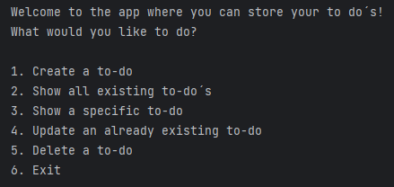

# Project: To do list

## Description

- What was your motivation?

My motivation was to create a to do list that would allow me to add tasks, mark them as complete, and delete them when I was done.
I also wanted to do a project with a MongoDB database.

- Why did you build this project?

I built this project to help people keep track of their tasks and also to practice TDD, MongoDB, Mockito, and GitHub CI.

- What problem does it solve?

This project solves the problem of forgetting to do tasks. It has a database that stores the tasks so that they can be accessed later.
The program can manage CRUD operations on the database.

- What did you learn?

I learned that a seemingly simple project can be very difficult to implement. 
I also learned how GitHub CI works and how to use Mockito with MongoDB.

## Installation

- Download MongoDB from https://www.mongodb.com/try/download/community. 
Follow the instructions and install MongoDB on your computer.
- Clone the project from GitHub.
- Open in IntelliJ or your preferred IDE.
- Run the project.
- Follow the instructions in the console to use the application.

## Usage

The application is used through the console.
When the application is run, the user is presented with a menu with the following options:

The user then uses the number keys to select an option and continues to follow the instructions in the console.

## Javaversion
JDK 19.0.1

## Dependencies
* [junit jupiter 5](https://mvnrepository.com/artifact/org.junit.jupiter/junit-jupiter/5.7.0)
* [Mockito Core 5.3.1](https://mvnrepository.com/artifact/org.mockito/mockito-core/5.3.1)
* [JSON In Java 20230227 2.4.2](https://mvnrepository.com/artifact/org.json/json/20230227)
* [MongoDB Driver 4.9.1](https://mvnrepository.com/artifact/org.mongodb/mongodb-driver-sync/)

## License
This project is licensed under the [MIT License](https://choosealicense.com/licenses/mit/)

## Credits
Received help from:
* [Marcus](https://github.com/marcusjobb)
* [chatGPT](https://chat.openai.com/)
* IntelliJ Copilot

Project tested by:
* [Jafar](https://github.com/Jafar-Hussein)

---
## Tests

To run tests:
* Open the project in IntelliJ or your preferred IDE. 
* Go to the folder named "test" and run the tests in the classes "TodoTest" and "MongoDBHandlerTest".

