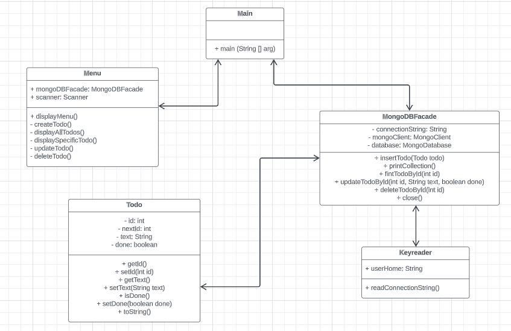

# Fredrik Rinstad

## Egna reflektioner
Jag uppskattar att denna utmaning hade tydliga instruktioner så att man vet vad som förväntas av en.

Det var en väldigt stor och tidskrävande uppgift för mig. Jag fastnade och behövde ta hjälp flera gånger för att komma vidare.
En sak som ofta är frustrerande för mig är när jag fastnar, söker hjälp och får olika lösningsförslag beroende på vart jag vänder mig.
Jag vet att det alltid finns flera olika sätt att göra saker på inom programmering, men jag saknar ändå ibland det "rätta svaret".

Jag behöver träna mer på att tänka ut vilka tester som behövs för mitt program, att mocka tester, att skapa databaser, koppla mig till databaser och kommunicera med databaser.

Men det var roligt att jag till slut fick ihop det (med lite hjälp) och hann lämna in arbetet i tid.
Och även om jag behöver träna mer på vissa saker så känner jag att det går framåt och att min förståelse generellt ökar.

## Projektet

### Beskrivning av projektet
Projektet är ett program som hanterar Todo's (att-göra-uppgifter).
CRUD-funktionalitet finns för alla Todo's. Man kan skapa nya Todo's, se de som redan finns samt uppdatera och ta bort.
Alla att-göra-uppgifterna har ett id, information om vad att-göra-uppgiften är och information om den är utförd eller ej. 
Att-göra-uppgifterna sparas i en MongoDB-databas.

Allt detta görs via ett CLI (Command Line Interface).

### Vad du har gjort
Eftersom detta var en enskild uppgift har jag gjort allt; klasser, metoder och tester. 
Jag har även skapat en databas i MongoDB och automatiska CI-tester i GitHub Actions.

## Planering
Det blev ingen bra planering inför detta projekt. 
Jag visste helt enkelt inte hur jag skulle göra så jag var tvungen att börja skapa klasser och metoder och allt eftersom så förstod jag hur det skulle se ut.

### Lösningsförslag innan uppgiften påbörjas

#### Hur du tänker försöka lösa uppgiften.(exempelvis)
Jag har ofta svårt för hur jag ska börja med projekt. 
Jag brukar behöver börja med att skapa några klasser och koda lite smått för att få en tydligare bild över vad jag behöver göra. 
Så jag vet inte riktigt hur jag ska förklara hur jag tänker lösa denna uppgift.

Jag vet åtminstone att jag ska ha en klass som heter Todo där egenskaperna för varje todo finns.
Men vilka ytterligare klasser som behövs vet jag inte riktigt än. Jag vet inte på rak arm hur man gör när man ska kommunicera med databasen.
Jag måste gå igenom mina anteckningar och söka runt lite på nätet.

Jag ska i alla fall använda mig av MongoDB och det lär ju då finnas en klass som kommunicerar med databasen.
Och kanske en klass för att läsa connectionsträngen.

#### Diagram.(exempelvis)
Jag skapade ett UML-diagram för att få en tydligare bild över hur jag ska lösa uppgiften. 
Men jag visste inte på förhand vilka klasser och metoder som skulle behövas så det blev inte så detaljerat från början men har fyllts på kontinuerligt.

### Jira/Trello/Github Project och projekthantering enligt Scrum/Kanban
Jag skapade även en to-do/KanBan-board på Github som heter "To do project". Där finns alla klasser som ska göras och vad de ska innehålla för metoder.
Även denna har fyllts på kontinuerligt under projektets gång då jag inte hade en tydlig bild över allt som behövdes göras från början.

[To do project](https://github.com/orgs/Campus-Molndal-JIN23/projects/60)

## Arbetet och dess genomförande
Jag började med att göra Todo-klassen. Där skapade jag egenskaperna för varje todo.
Sedan fokuserade jag på att skapa kopplingen med databasen i Keyreader-klassen och MongoDBHandler-klassen. 
Jag fick det till slut att fungera med lite hjälp från Marcus.
Sedan skapade jag metoderna i MongoDBHandler-klassen som skickar och hämtar data från databasen.

Jag hade missat att en meny skulle finnas så det gjorde jag efter metoderna i MongoDBHandler-klassen var klara.

Mitt arbete med detta projekt var inte så välorganiserat. 
Jag fick flera gånger ta hjälp från Marcus, klasskamrater, chatGPT och IntelliJ's copilot.

### Vad som varit svårt
Mycket var svårt med denna uppgift. Jag känner att jag inte har en bra uppfattning om hur man sätter ihop allt vi gått igenom.
MongoDB-kopplingen, testerna, Mockito, CI. Allt detta var svårt.

Jag känner att jag inte tränat tillräckligt mycket på detta och det blev en för stor uppgift för mig.
Jag blev frustrerad och kände mig stressad vid många tillfällen.

Jag måste repetera under sommarlovet och koda mycket mer.
Det blir ett bra tillfälle att gå igenom alla övningsuppgifter som finns på Github.

### Beskriv lite olika lösningar du gjort

- Jag har gjort en switch sats i Menu-klassen som skriver ut olika alternativ och sedan kallar på olika metoder i MongoDBHandler-klassen beroende på vad användaren väljer.
- Jag har skapat en metod ska heter resetNextId() som jag kallar på i BeforeEach i TestTodo-klassen för att återställa id:et till 1.
Detta gjorde jag för att testet testGetId skulle fungera på GitHub Actions. Innan dess så fungerade testet i IntelliJ men inte på GitHub Actions.

### Beskriv något som var besvärligt att få till
Att generera ett unikt ID-nummer för varje to-do var väldigt svårt att få till. Jag har ännu inte löst det till 100%.
Det kan fortfarande bli dubbletter om man startar om programmet och fortsätter att skapa to do's, men Marcus sa att det inte i alla fall inte var orsak till underkänt.

Att mocka testerna var också svårt. Där fick jag ta mycket hjälp av Marcus.

### Beskriv om du fått byta lösning och varför i sådana fall
Först så förstod jag inte att man skulle ha en meny. 
Så i början hade jag gjort att allt i konsolen skrevs ut ifrån MongoDBHandler-klassen.
Sedan ändrade jag detta och skrev ut det mesta från Menu-klassen.

## Reflektion & Slutsatser
Under sommaren behöver jag repetera allt vi gått igenom hittills.
Jag har inte tränat tillräckligt mycket på bland annat databaser, API:er, TDD, Mockito och CI.

När det är så många olika delar man inte har bra koll på så känns det övermäktigt och det blir bara stressigt.

Jag kände att jag bara ville få klart projektet snabbt och skicka in det, så att jag sedan i lugn och ro kunde gå tillbaka och gå igenom sådant som jag inte förstår.
Men detta blir ju egentligen helt omvänd ordning...

Jag ska som sagt repetera mycket under ledigheten och skriva egna anteckningar och lathundar till mig själv så att jag har ett slags "facit" för när jag är osäker på något.'
Jag vet att detta är ett bra sätt för mig att lära mig saker men jag har liksom inte hunnit med det under denna kurs.

### Vad gick bra
Det går bättre och bättre att skriva dokumentationen och README.md för varje projekt jag gör.
Det är roligt!

Att skriva ut menyn i Menu-klassen gick också bra.

### Vad gick dåligt
Att förstå vilka metoder jag behövde testa, vilka som skulle mockas och hur jag skulle göra detta.
Även att förstå vilka klasser jag behövde, vad de skulle göra och vad kopplingen mellan dem skulle vara.

### Vad har du lärt dig
Jag har lärt mig mer om hur man använder Mockito och att det skiljer sig beroende på om man använder sig av SQL eller MongoDB.
Jag har även lärt mig hur CI fungerar och att man kan skapa en YAML-fil direkt i IntelliJ. Det var väldigt smidigt.

### Vad hade ni gjort annorlunda om ni gjort om projektet
Jag hade gjort en riktig Fasad-klass för kommunikationen med databasen. 
Jag förstod inte riktigt vad det var när jag började detta projekt. 

Jag hade även skrivit ut allt ifrån Menu-klassen istället för att skriva ut vissa saker ifrån MongoDBHandler-klassen.

### Vilka möjligheter ser du med de kunskaper du fått under kursen.
Jag kan nu skapa program med automatiska tester och CI. Detta gör att jag kan skapa säkrare program och det känns väldigt bra att kunna.
Jag har även fått bättre förståelse för MongoDB och Mockito vilket känns bra.

